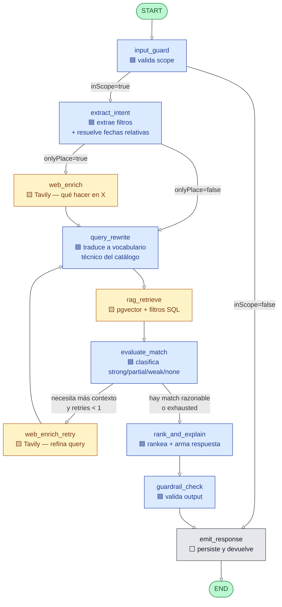
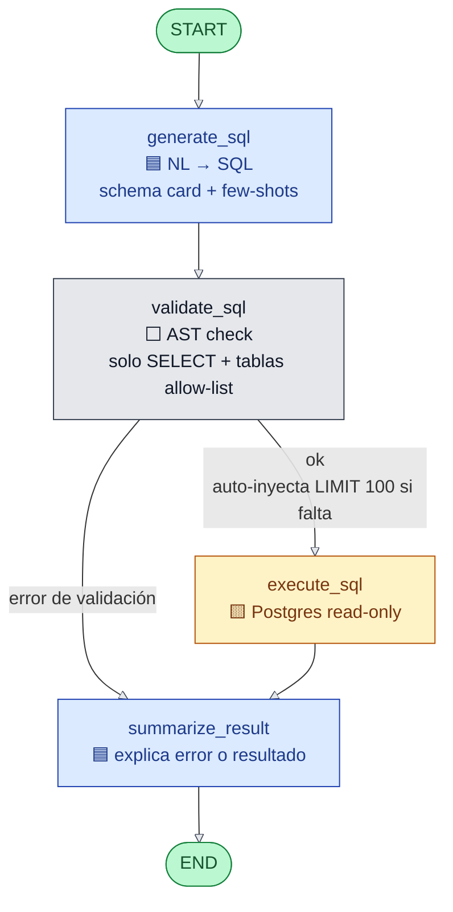
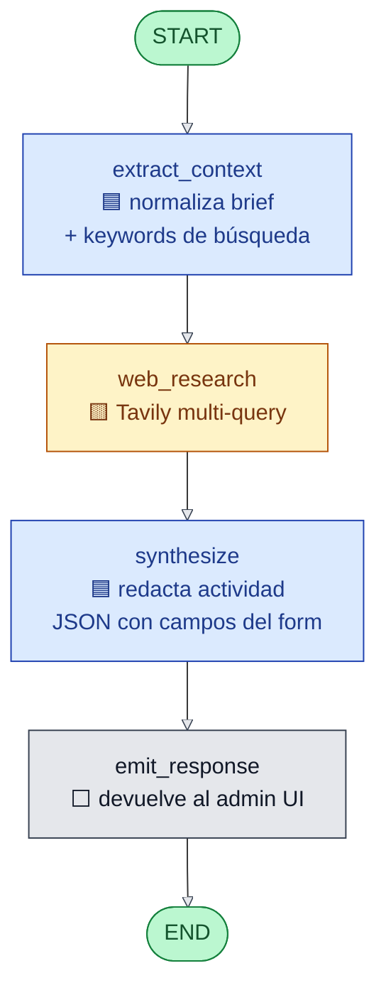

# Flujos de los agentes — diagramas para defensa

Vista visual de los 3 grafos LangGraph del TP. Pensado para abrir en pantalla
durante la demo: GitHub renderiza Mermaid de forma nativa.

**Convención de colores**:

- 🟦 **Azul** — nodo LLM (genera/clasifica con un modelo).
- 🟨 **Amarillo** — nodo con tool externa (Tavily, RAG, SQL).
- ⬜ **Gris** — nodo marcador (no llama al LLM, solo orquesta o emite).
- 🟢 **Verde** — START / END.

---

## 1. Customer Agent (`src/agents/customer/graph.ts`)

Atiende al **cliente final** del chat público. Implementa CRAG (Corrective RAG):
detecta cuándo el RAG local es insuficiente y enriquece con web search antes de
re-rankear. Además aplica **query rewriting** para alinear el vocabulario del
usuario con el catálogo enriquecido por audience tags (data augmentation).

**Nodos clave**:

| Nodo | Tipo | Qué hace |
|------|------|----------|
| `input_guard` | LLM | Clasifica binario in-scope (turismo) / out-of-scope. Bloquea jailbreaks. |
| `extract_intent` | LLM | Saca `place`, `maxPriceArs`, `targetDate`, `dateRange`, `onlyPlace`. Resuelve "próximo sábado", "mañana", etc. |
| `web_enrich` | Tool (Tavily) | Si solo hay lugar (sin actividad), busca *qué hacer en X* y agrega keywords al query RAG. |
| `query_rewrite` | LLM | **Traduce el `semanticQuery` a vocabulario técnico del catálogo** — convierte "para mi mamá con asma" en "baja altitud, sin desnivel, dificultad baja, apta para problemas respiratorios". Maximiza el matching contra los `audience_tags` y descripciones embebidas. |
| `rag_retrieve` | Tool (pgvector) | Búsqueda híbrida: filtros SQL (precio, `available_dates`) + ranking por embedding sobre el query enriquecido. |
| `evaluate_match` | LLM | Clasifica cada hit como `strong`/`partial`/`weak`/`none`. Decide si reintentar. |
| `web_enrich_retry` | Tool (Tavily) | Una sola vez: si match insuficiente, refina query con info externa — luego vuelve a `query_rewrite` para re-traducir con el contexto extra. |
| `rank_and_explain` | LLM | Rerankea con texto justificación y arma respuesta natural. |
| `guardrail_check` | LLM | Valida que el output no inventa datos ni se sale del scope. |
| `emit_response` | Marker | Persiste mensaje + dispara eventos analytics + responde al cliente. |

### Data augmentation en la ingesta (lado complementario)

El query rewrite es la mitad del puzzle. La otra mitad ocurre en `src/lib/services/audience-tags.ts`: **al crear o editar una actividad**, un LLM genera entre 3 y 8 etiquetas de "público ideal" (ej: *"familias con niños"*, *"adultos mayores"*, *"no recomendado para problemas cardíacos"*) que se persisten en `activities.audience_tags TEXT[]` y se concatenan al texto que va al embedder en `src/rag/ingest.ts`.

Resultado: el catálogo en pgvector contiene tanto la descripción técnica original como el vocabulario del público objetivo. Cuando el query reescrito menciona perfiles o condiciones, el matching vectorial encuentra activities con ese vocabulario en sus chunks. **Ningún filtro SQL nuevo** — la magia ocurre 100% en el espacio vectorial (Camino A en INFORME_TP §data augmentation).

---

## 2. Admin SQL Agent (`src/agents/admin-sql/graph.ts`)

**Text-to-SQL** del módulo D. Convierte preguntas en lenguaje natural del admin
en SQL read-only sobre el schema completo (activities, conversations, events).

**Nodos clave**:

| Nodo | Tipo | Qué hace |
|------|------|----------|
| `generate_sql` | LLM | Recibe `ANALYTICS_SCHEMA.md` como schema card + few-shots cubriendo agregaciones, recurrencia (`recurrence->>'kind'`), y disponibilidad (`= ANY(available_dates)`). |
| `validate_sql` | Marker | Parsea con `node-sql-parser`: rechaza no-SELECT, tablas fuera de allow-list, múltiples statements. Inyecta `LIMIT 100` si falta. |
| `execute_sql` | Tool (Postgres) | Ejecuta sobre conexión read-only con `SET TRANSACTION READ ONLY`. |
| `summarize_result` | LLM | Devuelve resumen NL + tabla. Si `validate_sql` falló, explica el error en español. |

---

## 3. Augment Activity Agent (`src/agents/augment-activity/graph.ts`)

**Data augmentation** desde el admin. El admin tipea una idea ("rafting en
Mendoza") y el agente investiga en web, sintetiza una actividad completa
(título, descripción, lugar sugerido, precio referencial) y la pre-popula en
el form de creación.

**Nodos clave**:

| Nodo | Tipo | Qué hace |
|------|------|----------|
| `extract_context` | LLM | A partir del brief libre del admin, decide qué buscar (lugar, tipo de actividad, ángulo). |
| `web_research` | Tool (Tavily) | 1-2 queries sobre el tema. Devuelve sources con URL + texto. |
| `synthesize` | LLM | Redacta `title`, `description`, `place`, `priceArs` (referencial), `tags`. Cita fuentes en el `description`. |
| `emit_response` | Marker | Devuelve JSON al cliente para pre-popular el form de creación. |

---

## Patrones compartidos entre los 3 agentes

- **`invokeStructured`** — todos los nodos LLM usan el wrapper de doble path
  (tool calling primario + JSON-in-markdown fallback). Garantiza un objeto
  validado por Zod incluso si el modelo no soporta tools nativas.
- **`requireField` / state guards** — los nodos validan precondiciones del
  state al entrar (ej. `requireIntent`) en vez de usar `state.x!` non-null
  assertions.
- **`pendingEvents`** — el grafo acumula eventos de analytics en un array y
  los persiste en batch al final del turno (1 transacción).
- **HMR-friendly cache** — en dev el grafo se recompila; el DataSource y el
  LLM se cachean en `globalThis` (caros).

---

## Cómo se ven en la demo

1. Abrir este archivo en GitHub o en VSCode con la preview de Mermaid.
2. Para la grabación: zoom 150% en el navegador + tema oscuro de GitHub.
3. Cada diagrama cabe en una slide; usarlos como pausa visual entre clips
   de UI.
